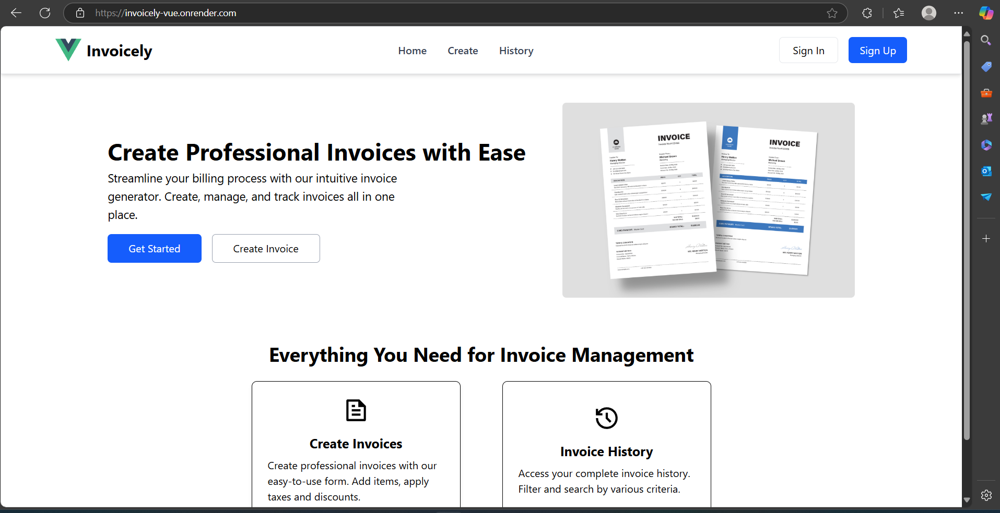
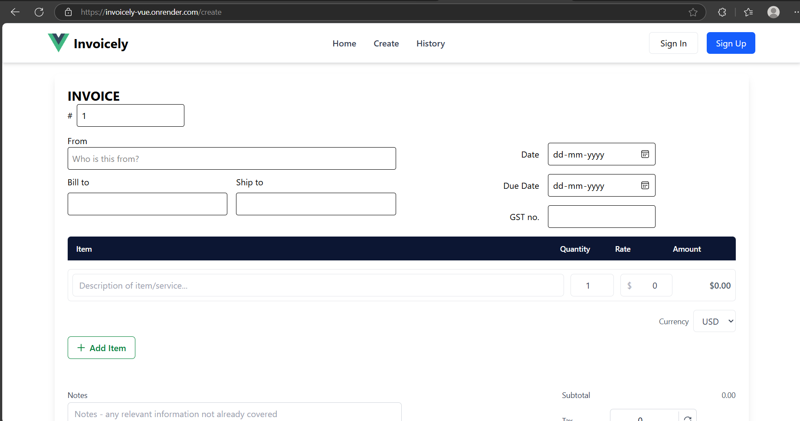
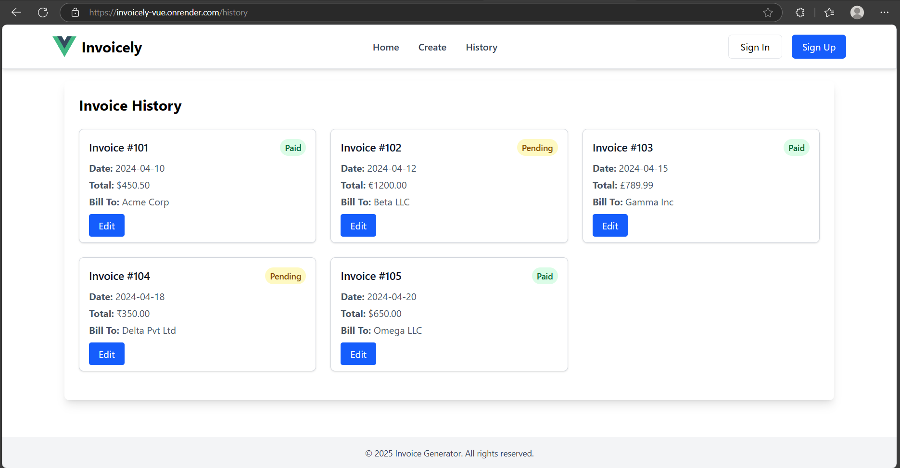
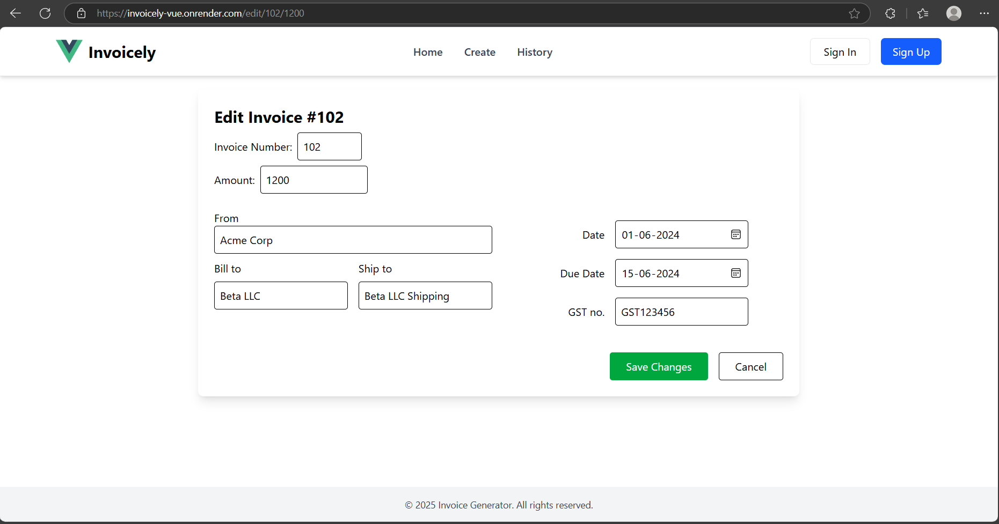

# invoice-generator-frontend-Harsh

# 📄 Invoice Generator                 
A responsive **Invoice Generator** web application built with **Vue.js** and **Tailwind CSS**. Create, edit, and manage invoices easily with a clean and intuitive user interface optimized for desktop and mobile.

## Main Pages are:                  
- Landing Page         
- Create Page        
- History Page             
- Edit Page               

## Features                                                                                                        
- Landing page with business logo and introduction    
- Create new invoices with detailed line items    
- Edit existing invoices        
- Invoice history page listing all created invoices     
- Responsive design for mobile, tablet, and desktop    
- Navigation menu for easy page access    
- Tailwind CSS styling for modern UI     
              
## 🛠️ Tech Stack

- [Vue.js](https://vuejs.org/) – Frontend framework
- [Vue Router](https://router.vuejs.org/) – Routing
- [Tailwind CSS](https://tailwindcss.com/) – Utility-first CSS framework
- [Remix Icon](https://remixicon.com/) – Icon library
- [Vite](https://vitejs.dev/) – Next generation frontend tooling             

## 📁 Project Structure
```
invoice-generator/           
├── src/       
│   ├── assets/           
│   ├── components/      
         ├── InvoiceCreation/         
         ├── LandingPage.vue         
         ├── EditPage.vue          
         ├── History.vue           
         ├── Navbar.vue                                
│   ├── router/                              
│   ├── App.vue                  
│   ├── main.js                                  

```


## 📄 Pages Documentation

### 🏠 LandingPage
- **Purpose:** Serves as the entry point with hero text, a hero image, and introductory content about the Invoice Generator.
- **Main Components:**
  - `LandingPage.vue` – Displays the landing content.
  - `Navbar.vue` – A persistent top navigation bar (used globally via `App.vue`).

### 🧾 InvoiceForm
- **Purpose:** A form interface to create or edit invoice details, including client info, billing, and line items.
- **Main Components:**
  - `InvoiceForm.vue` – Main container for the form layout and structure.
  - `FormMiddle.vue` – Handles the core input fields (like item rows, amounts, etc.).
  - Note: - Currently it

### 📜 History
- **Purpose:** Displays a list of previously generated invoices with basic summary info like invoice number, client, and total amount.
- **Main Component:**
  - `History.vue` – Handles displaying and possibly filtering the invoice history.          

### ✏️ EditPage
- **Purpose:** Allows editing of an existing invoice by preloading its data into the invoice form.
- **Main Component:**
  - `EditPage.vue` – Reuses form components to update an existing invoice.         


## Project Setup

```sh
npm install
```

### Compile and Hot-Reload for Development

```sh
npm run dev
```

### Compile and Minify for Production

```sh
npm run build
```


## ⚠️ Notes

- This version **does not include form validation**. Users can submit forms with empty or incomplete fields.
- Validation may be added in future updates.
- **History and Edit** components are Static **(Uses Static Data)**

## Website Images

### Landing Page
            

### Creation Page          
             

### History Page           
               

### Edit Page               
